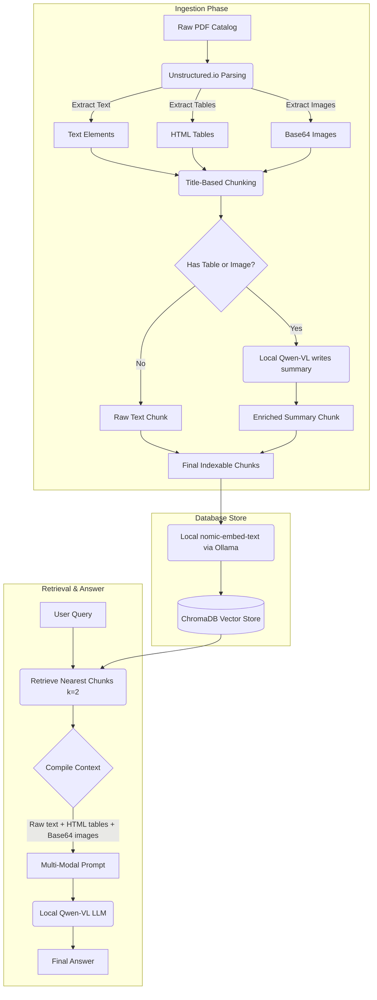

# Local Multi-Modal RAG Pipeline

This project is a local, offline Multi-Modal RAG (Retrieval-Augmented Generation) pipeline. It reads complex PDF files (like product catalogs or engineering documents with tables, charts, and diagrams) and lets you search and ask questions about them. 

The best part is that it runs **completely offline on your own machine**. There are no API costs, and no sensitive company documents are sent to external servers.

---

## Why I Built This (The Problem it Solves)

If you use standard RAG, it only reads plain text. But real-world business catalogs or specs contain:
* **Tables** with important technical numbers.
* **Diagrams, charts, and drawings** that explain how things work.
* **Headers and subheaders** that get messed up if you just split the text by character length.

Standard RAG will miss these visual and tabular details, leading to wrong answers or hallucinations.

To fix this, this pipeline does:
1. **Layout-Aware PDF Reading**: Uses `unstructured` to detect tables (saves them as HTML) and images (saves them as base64).
2. **Title-Based Chunking**: Groups text by headers and titles rather than random character limits, so paragraphs stay with their correct headings.
3. **AI-Powered Visual Search**: If a chunk has a table or an image, it uses a local vision LLM (`Qwen2-VL`) to write a descriptive summary. This summary is embedded and stored in the vector database so the search can actually find it.
4. **Multi-Modal Answer Generation**: When you ask a question, it retrieves the relevant chunks, compiles the raw text, the HTML tables, and the base64 images, and feeds them back into the local vision LLM to get a highly accurate answer based on both text and visual evidence.

---

## How the Data Flows

Here is a simple flow of how documents are processed and queried:



---

## Tech Stack

* **Document Extraction:** `unstructured` (with PDF and table parser)
* **Orchestration:** `LangChain`
* **Local Vision LLM:** `Qwen2-VL-7B-Instruct-AWQ` (run via a local OpenAI-compatible endpoint)
* **Vector Store:** `ChromaDB` (using cosine similarity)
* **Local Embeddings:** `nomic-embed-text` (run via `Ollama`)

---

## How to Set Up

### 1. Install System Tools
We need Poppler (to read PDFs), Tesseract (for OCR), and libmagic (to detect file types).

* **Ubuntu/Debian:**
  ```bash
  sudo apt-get update
  sudo apt-get install -y poppler-utils tesseract-ocr libmagic-dev
  ```

* **macOS:**
  ```bash
  brew install poppler tesseract libmagic
  ```

### 2. Install Python Libraries
Clone the project, set up a virtual environment, and install:
```bash
python -m venv venv
source venv/bin/activate
pip install -r requirements.txt
```
*(Or install them manually if you don't have requirements.txt):*
```bash
pip install -U "unstructured[all-docs]" langchain_chroma langchain langchain-community langchain-openai python-dotenv langchain-ollama
```

### 3. Run Local Models

* **Ollama (for embeddings):**
  Install Ollama and pull the embedding model:
  ```bash
  ollama run nomic-embed-text
  ```

* **Vision LLM (for summaries and answers):**
  You need to serve the `Qwen2-VL-7B-Instruct-AWQ` model locally on port `8005`. You can do this with `vLLM`:
  ```bash
  python -m vllm.entrypoints.openai.api_server \
      --model Qwen/Qwen2-VL-7B-Instruct-AWQ \
      --port 8005 \
      --api-key pranshu123
  ```

### 4. Configure Environment Variables
Create a `.env` file in the root folder of the project:
```env
OPENAI_API_BASE="http://localhost:8005/v1"
OPENAI_API_KEY="pranshu123"
```

---

## How to Run

Just run the python script:
```bash
python multi_modal_rag.py
```

### What it does when you run it:
1. **Parses the PDF**: Reads the PDF catalog defined in `PDF_PATH` (defaults to the concrete catalog) and extracts all text, tables, and images.
2. **Chunking & Summarizing**: Groups the extracted parts. If a chunk has a table or a diagram, it uses the local Qwen-VL model to write a summary of it.
3. **Saves to Vector DB**: Embeds the summaries using Ollama and indexes them in `db/chroma_db`. It also saves chunks to `chunks_export.json` so you can look at them.
4. **Retrieval Test**: Asks a test question (`"What is the ready mix concrete strength or applications?"`), grabs the best 2 chunks, collects the text/tables/images, and feeds them to Qwen-VL to print the final answer.
