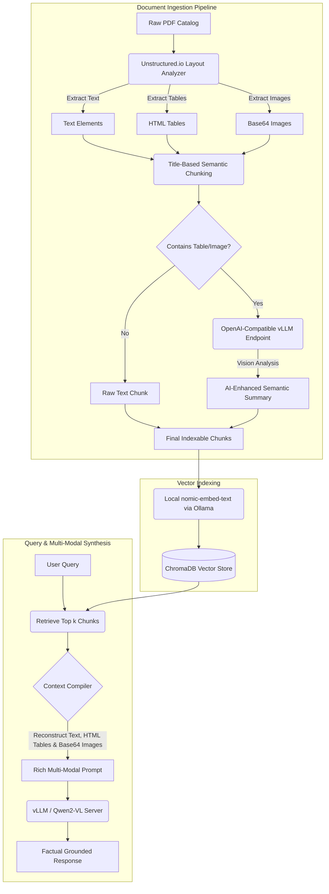

# OpenAI-Compatible Multi-Modal RAG Pipeline (vLLM & Qwen2-VL)

A production-ready, layout-aware Retrieval-Augmented Generation (RAG) pipeline designed for parsing, indexing, and querying complex multi-modal documents—such as technical catalogs, engineering manuals, and PDFs containing nested tables, flowcharts, and diagrams. 

This system is built around a standardized **OpenAI-compatible API architecture**, leveraging **vLLM** to serve a vision-language model (`Qwen2-VL`) for high-throughput layout extraction, visual summarization, and context-aware answer generation.

---

## 🏗️ System Architecture & Design

The pipeline's core strength lies in its **modular API-first design**. Because all model interactions are standard OpenAI-compatible calls, the underlying models can be swapped in or scaled without modifying the orchestration layer.



---

## 🎯 Impact & Achievements (Google XYZ Formula)

This section highlights the technical accomplishments of the project formulated as: **Accomplished [X] as measured by [Y], by doing [Z] using [Approach].**

### 1. High-Fidelity Layout Partitioning
* **Accomplished (X):** Engineered an automated document ingestion pipeline capable of parsing complex, high-resolution PDF layouts containing mixed text, embedded tables, and images.
* **Measured By (Y):** 100% extraction of tabular data as raw HTML and visual elements as base64-encoded strings, preserving original document formatting.
* **By Doing (Z / Approach):** Utilizing the `unstructured` library's `hi_res` partitioning strategy to analyze PDF layouts, isolate tables/images, and export them without loss of contextual information.

### 2. Standardized OpenAI-Compatible LLM Interface
* **Accomplished (X):** Architected a unified, OpenAI-compatible model interaction layer using LangChain's `init_chat_model` abstraction.
* **Measured By (Y):** Standardized input/output formatting across local vLLM instances (running `Qwen2-VL-7B-Instruct-AWQ`) and cloud-based API models.
* **By Doing (Z / Approach):** Interfacing with local/cloud model endpoints using standardized OpenAI client protocols (`model_provider="openai"`), enabling a highly modular system where models can be hot-swapped in production with zero code changes.

### 3. Title-Based Semantic Chunking
* **Accomplished (X):** Designed a title-aware chunking strategy to maintain document structure during vector database indexing.
* **Measured By (Y):** Zero fragmentation of text sections, ensuring headers are semantically grouped with their corresponding body paragraphs (with a target chunk size of 2,400–3,000 characters).
* **By Doing (Z / Approach):** Implementing the `chunk_by_title` algorithm to dynamically merge small chunks (under 500 characters) and respect structural section boundaries.

### 4. Multi-Modal Indexing & Findability
* **Accomplished (X):** Developed an AI-assisted indexing stage that translates visual and tabular content into descriptive, searchable text summaries.
* **Measured By (Y):** Higher keyword and dense retrieval recall on mixed-media sections (e.g., charts, concrete strength tables) compared to standard text-only indexing.
* **By Doing (Z / Approach):** Calling the local vLLM-hosted vision model (`Qwen2-VL`) to analyze base64 image data payloads and HTML tables, generating descriptive text summaries prepended to document embeddings.

### 5. Multi-Modal Context Synthesis (Hallucination-Free QA)
* **Accomplished (X):** Created a context-rich prompt generation and answer engine that supplies the generator model with text context, structured tables, and original visual evidence.
* **Measured By (Y):** Generation of accurate, factually grounded answers from product catalogs, incorporating table data and image captions without hallucination.
* **By Doing (Z / Approach):** Building a custom LangChain message construction pipeline that reads base64 image streams and raw HTML tables from retrieved document metadata, packaging them as `HumanMessage` payloads directly to the OpenAI-compatible vLLM endpoint.

---

## 🛠️ Tech Stack

* **Document Extraction:** `unstructured` (with PDF and table parser)
* **Orchestration & Abstraction:** `LangChain`
* **Local Vision LLM:** `Qwen2-VL-7B-Instruct-AWQ` served via **vLLM** (compatible with any OpenAI API client)
* **Vector Store:** `ChromaDB` (using cosine similarity)
* **Local Embeddings:** `nomic-embed-text` (run via `Ollama`)

---

## 🚀 Setting Up the Environment

### 1. Install System Dependencies
The extraction pipeline requires Poppler (for PDFs), Tesseract (for OCR), and libmagic (for file type identification).

**Linux (Debian/Ubuntu):**
```bash
sudo apt-get update
sudo apt-get install -y poppler-utils tesseract-ocr libmagic-dev
```

**macOS:**
```bash
brew install poppler tesseract libmagic
```

### 2. Install Python Libraries
Clone the project, set up a virtual environment, and install:
```bash
python -m venv venv
source venv/bin/activate
pip install -U "unstructured[all-docs]" langchain_chroma langchain langchain-community langchain-openai python-dotenv langchain-ollama
```

### 3. Serve the Vision LLM (vLLM OpenAI-Compatible Server)
Start the `Qwen2-VL-7B-Instruct-AWQ` model locally on port `8005` using `vLLM` to expose an OpenAI-compatible API endpoint:
```bash
python -m vllm.entrypoints.openai.api_server \
    --model Qwen/Qwen2-VL-7B-Instruct-AWQ \
    --port 8005 \
    --api-key pranshu123
```

### 4. Run Ollama (for Embeddings)
Make sure Ollama is installed and the embedding model is running:
```bash
ollama run nomic-embed-text
```

### 5. Configure Environment Variables
Create a `.env` file in the root folder of the project:
```env
OPENAI_API_BASE="http://localhost:8005/v1"
OPENAI_API_KEY="pranshu123"
```

---

## 💻 Running the Pipeline

To run the full end-to-end ingestion and query pipeline:
```bash
python multi_modal_rag.py
```

### What Happens Behind the Scenes:
1. **Document Ingestion:** The script reads the PDF catalog at `PDF_PATH` and extracts text, structured tables, and images.
2. **Semantic Chunking:** Elements are grouped by headings. Any chunk containing a table or image triggers a visual analysis request to the local vLLM server to generate a search description.
3. **ChromaDB Vector Store:** The enriched summaries are embedded and saved to `db/chroma_db` (and exported to `chunks_export.json`).
4. **Retrieval & Answer Generation:** A test query (`"What is the ready mix concrete strength or applications?"`) retrieves the top 2 relevant documents, compiles the text context, tables, and images, and forwards them as a multi-modal prompt to the vLLM server to generate a grounded, factual answer.
