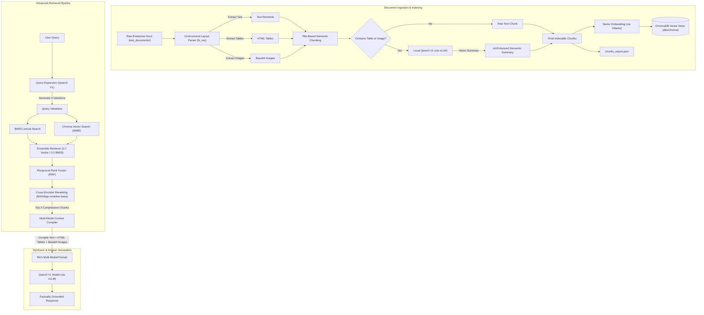

# Easy Build Multi-Modal RAG Pipeline (vLLM & Qwen2-VL)

A production-ready, layout-aware Retrieval-Augmented Generation (RAG) pipeline designed for parsing, indexing, and querying complex multi-modal enterprise documents. The pipeline handles nested tables, flowcharts, technical catalogs, and multi-folder corporate repositories, delivering highly grounded answers by combining advanced retrieval methods with vision-language models.

This system is built around a standardized **OpenAI-compatible API architecture**, leveraging **vLLM** to serve a vision-language model (`Qwen2-VL`) for layout extraction, visual summarization, and context-aware answer generation.

---

## 🏗️ System Architecture & Design

The pipeline's core strength lies in its **modular API-first design** and **advanced retrieval mechanics**. Model interactions follow standard OpenAI-compatible calls, enabling seamless scaling and swapping of underlying LLMs.



---

## 🎯 Key Achievements & Business Impact (Easy Build)

Developed to optimize document intelligence and enterprise retrieval workflows, this pipeline delivers high-fidelity information retrieval from complex multi-modal folders:

* **Recursive Multi-Document Directory Ingestion**: Walks the structured `test_documents/` folder recursively, processing all sub-directories containing company policies, product catalogs, financial records, and human resource guides.
* **High-Fidelity Layout Partitioning**: Isolates tabular data as raw HTML and visual assets as base64-encoded strings using the `unstructured` library's `hi_res` strategy, preserving 100% of formatting details from complex layouts.
* **Structure-Preserving Semantic Chunking**: Implemented a title-based dynamic chunking strategy (`chunk_by_title`) that prevents document fragmentation by ensuring headers are semantically grouped with their corresponding body paragraphs within a target chunk size of 2,400–3,000 characters.
* **AI-Powered Multi-Modal Searchability**: Built an automated vision indexing stage using the local Qwen-VL model to generate detailed, searchable text descriptions of tables and images, significantly improving keyword and dense retrieval recall on mixed-media materials.
* **Advanced Hybrid & Diversity Retrieval**: Employs LangChain's `EnsembleRetriever` to fuse dense vector search (utilizing **Maximal Marginal Relevance (MMR)** for context diversity) with sparse BM25 lexical search (weighted `0.7` vector / `0.3` BM25).
* **Multi-Query Expansion & RRF Blending**: Expands the user query into 3 distinct variations using LLM structured output, retrieves candidate documents for each variation, and blends the resulting ranks using **Reciprocal Rank Fusion (RRF)**.
* **Cross-Encoder Reranking**: Re-scores candidate documents using a local `BAAI/bge-reranker-base` cross-encoder, compressing the context to the top 3 high-relevance chunks to avoid context stuffing and lower LLM inference latency.
* **Hallucination-Free Multi-Modal Context Synthesis**: Compiles retrieved text, HTML tables, and base64 image streams into structured LangChain message payloads, allowing the LLM to generate grounded, factually accurate answers.

---

## 📂 Enterprise Corpus Structure (`test_documents`)

The ingestion pipeline partitions and indexes the following structured folders in `test_documents/` representing various business units and domains:

* `01_company_overview`: Corporate history, executive structures, and high-level summaries.
* `02_sales_and_revenue`: Financial reports, revenue dashboards, and sales figures.
* `03_products_and_catalog`: Product brochures, technical specifications, and catalogs.
* `04_supply_chain_and_warehouses`: Logistics guidelines, warehouse locations, and distribution schedules.
* `05_customer_support`: Support workflows, SLAs, and troubleshooting databases.
* `06_human_resources`: Employee handbooks, onboarding guides, and payroll structures.
* `07_finance_and_procurement`: Procurement workflows, vendor info, and auditing files.
* `08_technology_and_ai`: Architecture documents, internal tool descriptions, and AI guidelines.
* `09_policies_and_compliance`: Regulatory requirements, security protocols, and compliance checklists.
* `10_projects_and_meetings`: Meeting minutes, sprint goals, and upcoming initiatives.
* `11_multimodal_documents`: Documents rich in charts, tables, diagrams, and base64 images.
* `12_legacy_and_superseded_documents`: Archive files used for historic alignment.
* `13_rag_benchmark_questions`: Evaluation questions targeting various levels of retrieval difficulty.
* `14_ground_truth_answers`: Hand-curated answers for retrieval-generation validation.
* `15_metadata_and_evaluation`: Performance sheets and grading configurations.

---

## 🛠️ Tech Stack

* **Document Extraction:** `unstructured` (with PDF and table parser)
* **Orchestration & Abstraction:** `LangChain`
* **Local Vision LLM:** `Qwen2-VL-7B-Instruct-AWQ` served via **vLLM** (compatible with any OpenAI API client)
* **Vector Store:** `ChromaDB` (using cosine similarity)
* **Local Embeddings:** `nomic-embed-text` (run via `Ollama`)
* **Cross-Encoder Model:** `BAAI/bge-reranker-base` via `sentence-transformers`

---

## 🚀 Setting Up the Environment

### 1. Install System Dependencies
The extraction pipeline requires Poppler (for PDFs), Tesseract (for OCR), and libmagic (for file type identification).

**Linux (Debian/Ubuntu):**
```bash
sudo apt-get update
sudo apt-get install -y poppler-utils tesseract-ocr libmagic-dev
```

**macOS:**
```bash
brew install poppler tesseract libmagic
```

### 2. Install Python Libraries
Set up a virtual environment and install the required packages:
```bash
python -m venv venv
source venv/bin/activate
pip install -U "unstructured[all-docs]" langchain_chroma langchain langchain-community langchain-openai python-dotenv langchain-ollama sentence-transformers langchain-cohere
```

### 3. Serve the Vision LLM (vLLM OpenAI-Compatible Server)
Start the `Qwen2-VL-7B-Instruct-AWQ` model locally on port `8005` using `vLLM`:
```bash
python -m vllm.entrypoints.openai.api_server \
    --model Qwen/Qwen2-VL-7B-Instruct-AWQ \
    --port 8005 \
    --api-key pranshu123
```

### 4. Run Ollama (for Embeddings)
Make sure Ollama is running and the embedding model is active:
```bash
ollama run nomic-embed-text
```

### 5. Configure Environment Variables
Create a `.env` file in the root folder of the project:
```env
OPENAI_API_BASE="http://localhost:8005/v1"
OPENAI_API_KEY="pranshu123"
```

---

## 💻 Running the Pipeline

### Step 1: Ingestion & Vector Indexing
To parse the recursive directories in `test_documents/` and index the enriched chunks:
```bash
python multi_modal_rag.py
```
* **What happens**: Documents in `test_documents/` are partitioned and semantic chunks are created. Any chunk containing a table/image triggers a Qwen2-VL vision request to generate a search description. The results are stored in the vector store at `dbs/chroma` and exported to `chunks_export.json`.

### Step 2: Advanced Retrieval & Multi-Modal Synthesis
To query the database using the advanced pipeline (Multi-Query -> Hybrid MMR & BM25 -> RRF -> Cross-Encoder Reranking -> Qwen2-VL synthesis):
```bash
python retrival_methods.py
```
* **What happens**: The script loads the vector database from `dbs/chroma` and constructs the BM25 search index. It generates 3 variations of the query, retrieves candidates via the hybrid ensemble, fuses them using RRF, reranks them using `BAAI/bge-reranker-base` to output the top 3 candidates, and constructs a rich multi-modal prompt containing text, HTML tables, and images. The local Qwen2-VL model then generates a factually grounded answer.
