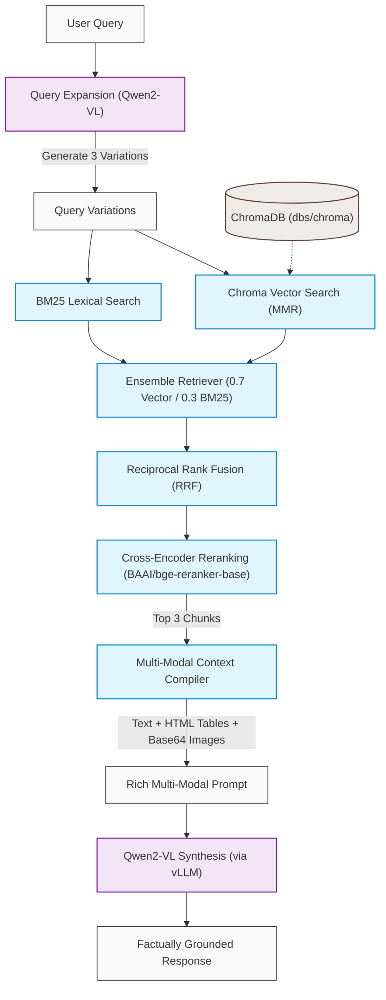

# 🏗️ Easy Build Multi-Modal RAG Pipeline (vLLM & Qwen2-VL)

A production-ready, layout-aware Retrieval-Augmented Generation (RAG) pipeline designed for parsing, indexing, and querying complex multi-modal enterprise documents. The pipeline processes nested tables, flowcharts, technical catalogs, and multi-folder corporate repositories, delivering highly grounded answers by combining advanced retrieval methods with vision-language models.

This system is built around a standardized **OpenAI-compatible API architecture**, leveraging **vLLM** to serve a vision-language model (`Qwen2-VL`) for layout extraction, visual summarization, and context-aware answer generation.

---

## 🛠️ Tech Stack & Dependencies

```html
<p align="left">
  
  
  
  
  
  
</p>
```

| Component | Technology / Model | Role in System | Deployment |
| :--- | :--- | :--- | :--- |
| **Document Parser** | `Unstructured.io` | Extract layout, text, tables, and images from PDFs | Local |
| **Orchestration** | `LangChain` | Query expansion, retrieval chains, and LLM orchestration | Local |
| **Vision LLM** | `Qwen2-VL-7B-Instruct-AWQ` | Visual descriptions, query expansion & final synthesis | Local (served via `vLLM`) |
| **Vector Store** | `ChromaDB` | Persistent indexing and semantic retrieval | Local |
| **Embeddings** | `nomic-embed-text` | Generate vector representations of text chunks | Local (via `Ollama`) |
| **Reranker** | `BAAI/bge-reranker-base` | Cross-encoder relevance scoring of candidate chunks | Local (via `sentence-transformers`) |

---

## ⚙️ Pipeline System Architecture

To ensure high readability and maintain structural clarity, the architecture is split into two independent, sequential pipelines:

### 1. Document Ingestion & Indexing Pipeline

This pipeline recursively scans the target directory, extracts structural and visual elements, runs multimodal summaries on image-rich blocks, and generates vector indices.


### 2. Advanced Multi-Query Retrieval & Synthesis Pipeline

This pipeline takes user queries, expands them to capture multi-angle context, runs hybrid dense/sparse searches, blends results using Reciprocal Rank Fusion, rerank-compresses candidates, and synthesizes grounded answers.



---

## 📂 Enterprise Corpus Structure (`test_documents`)

The ingestion pipeline partitions and indexes the following structured folders representing various business units and domains:

| Directory | Focus / Domain | Description / Content |
| :--- | :--- | :--- |
| 📁 `01_company_overview` | Corporate Profile | Executive structures, company history, and key mission statements. |
| 📁 `02_sales_and_revenue` | Sales & Finances | Revenue dashboards, quarterly sales reports, and figures. |
| 📁 `03_products_and_catalog` | Product Specifications | Technical brochures, manuals, product catalogs, and dimensions. |
| 📁 `04_supply_chain_and_warehouses` | Logistics & Operations | Warehouse distribution, dispatch schedules, and inventory tracking. |
| 📁 `05_customer_support` | Support Databases | Resolution workflows, SLA parameters, and customer-care manuals. |
| 📁 `06_human_resources` | Personnel & Culture | HR policies, employee handbooks, onboarding guides, and payroll. |
| 📁 `07_finance_and_procurement` | Procurement & Audits | Vendor relations, purchasing guides, and auditing documentation. |
| 📁 `08_technology_and_ai` | Engineering & Tools | System architecture sheets, infrastructure tools, and tech stacks. |
| 📁 `09_policies_and_compliance` | Regulations & Safety | Compliance checklists, safety regulations, and environmental codes. |
| 📁 `10_projects_and_meetings` | Project Management | Standup logs, sprint goals, meeting notes, and roadmap plans. |
| 📁 `11_multimodal_documents` | Graphics & Tables | Complex documents containing flowcharts, diagrams, and figures. |
| 📁 `12_legacy_and_superseded_documents` | Archive & History | Obsolete/superseded catalogs and manuals kept for compliance tracking. |
| 📁 `13_rag_benchmark_questions` | QA Evaluation | Test query suites designed to assess retrieval accuracy. |
| 📁 `14_ground_truth_answers` | Validation Baselines | Curated reference answers for assessing retrieval-generation output. |
| 📁 `15_metadata_and_evaluation` | Performance Metrics | Scoring frameworks and metadata mappings for RAG metrics. |

---

## 🎯 Key Achievements & Implementation Merits

* **Recursive Multi-Document Extraction**: Replaces flat single-file ingestion with directory-wide indexing across 15 custom domains.
* **Hybrid & Diversity Retrieval**: Employs LangChain's `EnsembleRetriever` to fuse dense vector search (utilizing **Maximal Marginal Relevance (MMR)** for context diversity) with sparse BM25 lexical search (weighted `0.7` vector / `0.3` BM25).
* **Multi-Query RRF Blending**: Expands the user query into 3 variations using LLM structured output, retrieves candidate documents for each, and blends the resulting ranks using **Reciprocal Rank Fusion (RRF)**.
* **Cross-Encoder Reranking**: Re-scores candidate documents using a local `BAAI/bge-reranker-base` cross-encoder, compressing the context to the top 3 high-relevance chunks to avoid context stuffing and lower LLM inference latency.
* **Layout Partitioning**: Isolates tabular data as raw HTML and visual assets as base64-encoded strings using the `unstructured` library's `hi_res` strategy.

---

## 🚀 Setting Up the Environment

### 1. Install System Dependencies
The extraction pipeline requires Poppler (for PDFs), Tesseract (for OCR), and libmagic (for file type identification).

**Linux (Debian/Ubuntu):**
```bash
sudo apt-get update
sudo apt-get install -y poppler-utils tesseract-ocr libmagic-dev
```

**macOS:**
```bash
brew install poppler tesseract libmagic
```

### 2. Install Python Libraries
Set up a virtual environment and install the required packages:
```bash
python -m venv venv
source venv/bin/activate
pip install -U "unstructured[all-docs]" langchain_chroma langchain langchain-community langchain-openai python-dotenv langchain-ollama sentence-transformers langchain-cohere
```

### 3. Serve the Vision LLM (vLLM OpenAI-Compatible Server)
Start the `Qwen2-VL-7B-Instruct-AWQ` model locally on port `8005` using `vLLM`:
```bash
python -m vllm.entrypoints.openai.api_server \
    --model Qwen/Qwen2-VL-7B-Instruct-AWQ \
    --port 8005 \
    --api-key pranshu123
```

### 4. Run Ollama (for Embeddings)
Make sure Ollama is running and the embedding model is active:
```bash
ollama run nomic-embed-text
```

### 5. Configure Environment Variables
Create a `.env` file in the root folder of the project:
```env
OPENAI_API_BASE="http://localhost:8005/v1"
OPENAI_API_KEY="pranshu123"
```

---

## 💻 Running the Pipeline

### Step 1: Ingestion & Vector Indexing
To parse the recursive directories in `test_documents/` and index the enriched chunks:
```bash
python multi_modal_rag.py
```

> [!NOTE]
> Documents in `test_documents/` are partitioned and semantic chunks are created. Any chunk containing a table/image triggers a Qwen2-VL vision request to generate a search description. The results are stored in the vector store at `dbs/chroma` and exported to `chunks_export.json`.

### Step 2: Advanced Retrieval & Multi-Modal Synthesis
To query the database using the advanced pipeline (Multi-Query -> Hybrid MMR & BM25 -> RRF -> Cross-Encoder Reranking -> Qwen2-VL synthesis):
```bash
python retrival_methods.py
```

> [!TIP]
> The script loads the vector database from `dbs/chroma` and constructs the BM25 search index. It generates 3 variations of the query, retrieves candidates via the hybrid ensemble, fuses them using RRF, reranks them using `BAAI/bge-reranker-base` to output the top 3 candidates, and constructs a rich multi-modal prompt containing text, HTML tables, and images. The local Qwen2-VL model then generates a factually grounded answer.
