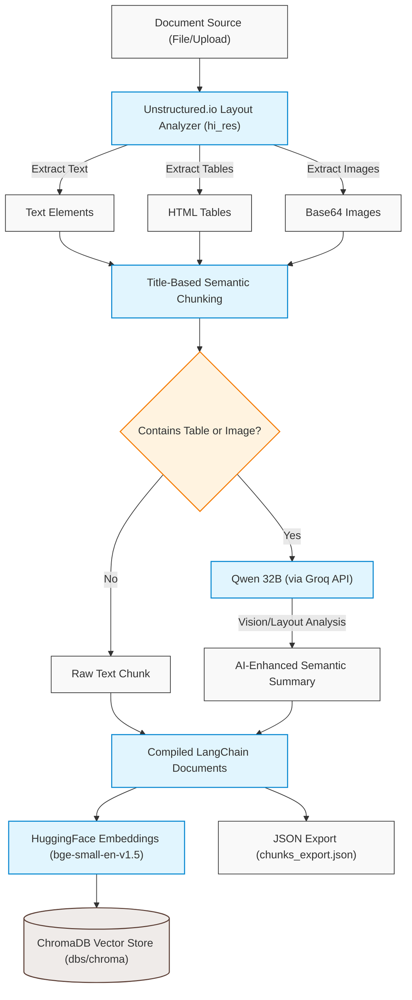

# 🏗️ Easy Build Multi-Modal RAG Pipeline

[](https://omniparse-rag.streamlit.app/)

A production-ready, layout-aware Retrieval-Augmented Generation (RAG) pipeline designed for parsing, indexing, and querying complex multi-modal enterprise documents. The pipeline processes nested tables, flowcharts, technical catalogs, and multi-folder corporate repositories, delivering highly grounded answers by combining advanced retrieval methods with vision-capable language models.

This system is built around an **advanced hybrid retrieval and reranking architecture**, leveraging **Streamlit** for the frontend, **LangChain** for orchestration, and **Groq** to access high-performance LLMs (`qwen/qwen3-32b`) for layout summarization, query expansion, and context-aware answer generation.

* **Live Application:** [omniparse-rag.streamlit.app](https://omniparse-rag.streamlit.app/)

---

## 🛠️ Tech Stack & Dependencies

```html
<p align="left">
  
  
  
  
  
  
</p>
```

| Component | Technology / Model | Role in System | Deployment |
| :--- | :--- | :--- | :--- |
| **User Interface** | `Streamlit` | Interactive dashboard with "Easy Build" (pre-indexed search) and "Upload Document" modes | Cloud / Local |
| **Document Parser** | `Unstructured.io` | Extract layout, text, tables, and images using `hi_res` partitioning | Local |
| **Orchestration** | `LangChain` | Query expansion, retrieval chains, and LLM orchestration | Local |
| **Language Model** | `qwen/qwen3-32b` | Chunk summarization, query expansion, and final answer synthesis | Remote (Groq API) |
| **Vector Store** | `ChromaDB` | Persistent indexing and semantic retrieval | Local / Persistent |
| **Embeddings** | `BAAI/bge-small-en-v1.5` | Generate vector representations of text chunks | Local (CPU-friendly via HF) |
| **Reranker** | `BAAI/bge-reranker-base` | Cross-encoder relevance scoring of candidate chunks | Local (CPU-friendly via HF) |

---

## ⚙️ Pipeline System Architecture

The architecture is split into two independent, sequential pipelines to ensure structural clarity and layout awareness:

### 1. Document Ingestion & Indexing Pipeline (`ingestion_pipeline.py`)

This pipeline scans document sources (or uploaded files), extracts structural and visual elements, runs layout-aware summaries on image/table-rich blocks, and generates vector indices.



### 2. Advanced Multi-Query Retrieval & Synthesis Pipeline (`retrival_methods.py`)

This pipeline takes the user query, expands it to capture multi-angle context, runs hybrid dense/sparse searches, blends results using Reciprocal Rank Fusion, rerank-compresses candidates, and synthesizes grounded answers while displaying the LLM's thinking process.


---

## 📂 Enterprise Corpus Structure (`other documents`)

The ingestion pipeline partitions and indexes the structured folders representing various business units and domains:

| Directory | Focus / Domain | Description / Content |
| :--- | :--- | :--- |
| 📁 `01_company_overview` | Corporate Profile | Executive structures, company history, and key mission statements. |
| 📁 `02_sales_and_revenue` | Sales & Finances | Revenue dashboards, quarterly sales reports, and figures. |
| 📁 `03_products_and_catalog` | Product Specifications | Technical brochures, manuals, product catalogs, and dimensions. |
| 📁 `04_supply_chain_and_warehouses` | Logistics & Operations | Warehouse distribution, dispatch schedules, and inventory tracking. |
| 📁 `05_customer_support` | Support Databases | Resolution workflows, SLA parameters, and customer-care manuals. |
| 📁 `06_human_resources` | Personnel & Culture | HR policies, employee handbooks, onboarding guides, and payroll. |
| 📁 `07_finance_and_procurement` | Procurement & Audits | Vendor relations, purchasing guides, and auditing documentation. |
| 📁 `08_technology_and_ai` | Engineering & Tools | System architecture sheets, infrastructure tools, and tech stacks. |
| 📁 `09_policies_and_compliance` | Regulations & Safety | Compliance checklists, safety regulations, and environmental codes. |
| 📁 `10_projects_and_meetings` | Project Management | Standup logs, sprint goals, meeting notes, and roadmap plans. |
| 📁 `11_multimodal_documents` | Graphics & Tables | Complex documents containing flowcharts, diagrams, and figures. |
| 📁 `12_legacy_and_superseded_documents` | Archive & History | Obsolete/superseded catalogs and manuals kept for compliance tracking. |
| 📁 `13_rag_benchmark_questions` | QA Evaluation | Test query suites designed to assess retrieval accuracy. |
| 📁 `14_ground_truth_answers` | Validation Baselines | Curated reference answers for assessing retrieval-generation output. |
| 📁 `15_metadata_and_evaluation` | Performance Metrics | Scoring frameworks and metadata mappings for RAG metrics. |

---

## 🎯 Key Pipeline Merits & Implementation Highlights

* **Dual-Mode Streamlit App (`main.py`)**:
  * **Easy Build**: Direct query interface over the pre-indexed vector knowledge base.
  * **Upload Document**: Allows uploading standard documents (`PDF`, `DOCX`, `PPTX`, `XLSX`, `CSV`) to parse, chunk, summarize, and index them on-the-fly for real-time querying.
* **Layout-Aware Partitioning**: Uses the `unstructured` library's `hi_res` strategy to extract text blocks, isolate tabular data as raw HTML tables, and extract visual elements as base64-encoded strings.
* **Smart Summarization**: Chunks containing tables or images are enhanced by generating an AI summary via `qwen/qwen3-32b` to preserve structural and visual context.
* **Query Expansion & Hybrid Retrieval**: Expands the user query into 3 variations using structured output from Qwen. Retrieves candidate documents for each variation using an `EnsembleRetriever` combining dense vector search (with **Maximal Marginal Relevance (MMR)** for context diversity) and sparse **BM25** lexical search (weighted `0.7` vector / `0.3` BM25).
* **Reciprocal Rank Fusion (RRF)**: Blends and re-scores candidates retrieved across all expanded query variations.
* **Cross-Encoder Reranking**: Re-scores candidates using a local `BAAI/bge-reranker-base` cross-encoder to select the top 3 highest-relevance chunks, avoiding context-window stuffing and reducing LLM inference latency.
* **Chain-of-Thought (CoT) Visibility**: Automatically captures and displays the model's `<think>` reasoning path inside a Streamlit expander component for complete transparency.

---

## 🚀 Setting Up the Environment

### 1. Install System Dependencies
The extraction pipeline requires Poppler (for PDFs), Tesseract (for OCR), libmagic (for file type identification), LibreOffice (for office doc parsing), and Pandoc.

**Linux (Debian/Ubuntu):**
```bash
sudo apt-get update
sudo apt-get install -y poppler-utils tesseract-ocr libmagic-dev libreoffice pandoc
```

**macOS:**
```bash
brew install poppler tesseract libmagic libreoffice pandoc
```

### 2. Install Python Libraries
This project uses `uv` for dependency management. Set up a virtual environment and install the required packages:

```bash
# Create virtual environment and sync packages
uv venv
source .venv/bin/activate
uv pip install -r pyproject.toml
```

### 3. Configure Environment Variables
Create a `.env` file in the root directory of the project and add your Groq API key:
```env
GROQ_API_KEY="your-groq-api-key-here"
```

---

## 💻 Running the Application & Scripts

### Run the Streamlit Web Application
To run the interactive RAG dashboard:
```bash
streamlit run main.py
```

### Run Standalone Ingestion
To parse a document manually and build the vector database index:
```bash
python ingestion_pipeline.py
```

> [!NOTE]
> By default, the ingestion script processes documents, extracts their tables/images, generates AI summaries, and stores the persistent collection at `dbs/chroma` while exporting the chunk details to `chunks_export.json`.

### Run Standalone Retrieval Query
To run a query in the terminal through the advanced multi-query, hybrid retrieval, RRF, and reranked pipeline:
```bash
python retrival_methods.py
```
