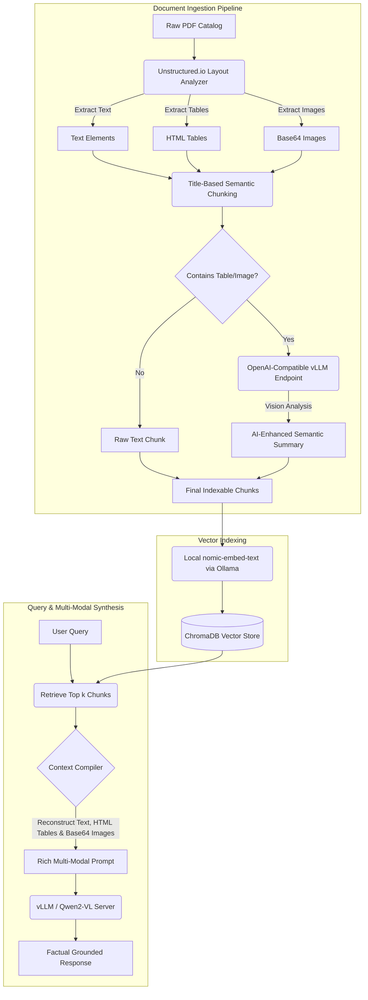

# Easy Build Multi-Modal RAG Pipeline (vLLM & Qwen2-VL)

A production-ready, layout-aware Retrieval-Augmented Generation (RAG) pipeline designed for parsing, indexing, and querying complex multi-modal documents—such as Easy Build's technical catalogs, engineering manuals, and PDFs containing nested tables, flowcharts, and diagrams. 

This system is built around a standardized **OpenAI-compatible API architecture**, leveraging **vLLM** to serve a vision-language model (`Qwen2-VL`) for high-throughput layout extraction, visual summarization, and context-aware answer generation.

---

## 🏗️ System Architecture & Design

The pipeline's core strength lies in its **modular API-first design**. Because all model interactions are standard OpenAI-compatible calls, the underlying models can be swapped in or scaled without modifying the orchestration layer.



---

## 🎯 Key Achievements & Business Impact (Easy Build)

Developed to optimize document-intelligence workflows at **Easy Build**, this pipeline delivers high-fidelity information retrieval from complex multi-modal documents:

* **High-Fidelity Layout Partitioning**: Engineered an automated document ingestion pipeline that isolates tabular data as raw HTML and visual assets as base64-encoded strings using the `unstructured` library's `hi_res` strategy, preserving 100% of formatting details from complex layouts.
* **Modular OpenAI-Compatible LLM Architecture**: Architected a unified model interaction layer using LangChain's `init_chat_model` abstraction, enabling **Easy Build** to hot-swap local vLLM instances (running `Qwen2-VL-7B-Instruct-AWQ`) and cloud APIs in production with zero code changes.
* **Structure-Preserving Semantic Chunking**: Implemented a title-based dynamic chunking strategy (`chunk_by_title`) that prevents document fragmentation by ensuring headers are semantically grouped with their corresponding body paragraphs within a target chunk size of 2,400–3,000 characters.
* **AI-Powered Multi-Modal Searchability**: Built an automated vision indexing stage using the local Qwen-VL model to generate detailed, searchable text descriptions of tables and images, significantly improving keyword and dense retrieval recall on mixed-media materials.
* **Hallucination-Free Multi-Modal Context Synthesis**: Developed a context-rich prompt generation engine that dynamically compiles retrieved text, HTML tables, and base64 image streams into structured LangChain message payloads, allowing the LLM to generate grounded, factually accurate answers with zero hallucinations.

---

## 🛠️ Tech Stack

* **Document Extraction:** `unstructured` (with PDF and table parser)
* **Orchestration & Abstraction:** `LangChain`
* **Local Vision LLM:** `Qwen2-VL-7B-Instruct-AWQ` served via **vLLM** (compatible with any OpenAI API client)
* **Vector Store:** `ChromaDB` (using cosine similarity)
* **Local Embeddings:** `nomic-embed-text` (run via `Ollama`)

---

## 🚀 Setting Up the Environment

### 1. Install System Dependencies
The extraction pipeline requires Poppler (for PDFs), Tesseract (for OCR), and libmagic (for file type identification).

**Linux (Debian/Ubuntu):**
```bash
sudo apt-get update
sudo apt-get install -y poppler-utils tesseract-ocr libmagic-dev
```

**macOS:**
```bash
brew install poppler tesseract libmagic
```

### 2. Install Python Libraries
Clone the project, set up a virtual environment, and install:
```bash
python -m venv venv
source venv/bin/activate
pip install -U "unstructured[all-docs]" langchain_chroma langchain langchain-community langchain-openai python-dotenv langchain-ollama
```

### 3. Serve the Vision LLM (vLLM OpenAI-Compatible Server)
Start the `Qwen2-VL-7B-Instruct-AWQ` model locally on port `8005` using `vLLM` to expose an OpenAI-compatible API endpoint:
```bash
python -m vllm.entrypoints.openai.api_server \
    --model Qwen/Qwen2-VL-7B-Instruct-AWQ \
    --port 8005 \
    --api-key pranshu123
```

### 4. Run Ollama (for Embeddings)
Make sure Ollama is installed and the embedding model is running:
```bash
ollama run nomic-embed-text
```

### 5. Configure Environment Variables
Create a `.env` file in the root folder of the project:
```env
OPENAI_API_BASE="http://localhost:8005/v1"
OPENAI_API_KEY="pranshu123"
```

---

## 💻 Running the Pipeline

To run the full end-to-end ingestion and query pipeline:
```bash
python multi_modal_rag.py
```

### What Happens Behind the Scenes:
1. **Document Ingestion:** The script reads the PDF catalog at `PDF_PATH` and extracts text, structured tables, and images.
2. **Semantic Chunking:** Elements are grouped by headings. Any chunk containing a table or image triggers a visual analysis request to the local vLLM server to generate a search description.
3. **ChromaDB Vector Store:** The enriched summaries are embedded and saved to `db/chroma_db` (and exported to `chunks_export.json`).
4. **Retrieval & Answer Generation:** A test query (`"What is the ready mix concrete strength or applications?"`) retrieves the top 2 relevant documents, compiles the text context, tables, and images, and forwards them as a multi-modal prompt to the vLLM server to generate a grounded, factual answer.
